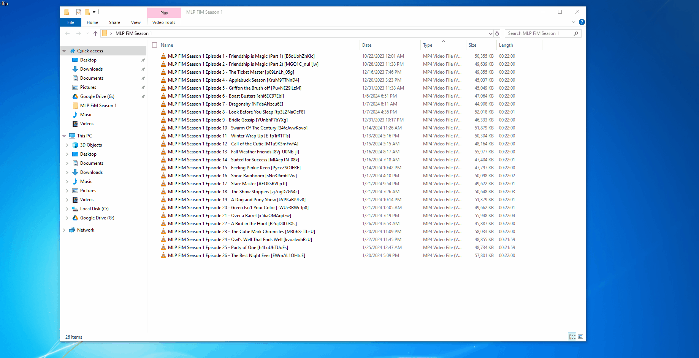

# subtitle-renamer
 
 A simple GUI based subtitle renaming tool, written in Python. This program doesn't pull any data from the internet, all data should be stored locally.

## How To Use

- Place video files and subtitle files in the same folder and open the folder in the program.
- The program should automatically match the files together, but if there is any problems, you can manually move the files to match using the arrow buttons.
- Click "Rename"

## Disclaimer:

This program is not actively maintained. Please backup your video and subtitle files before running the program.
